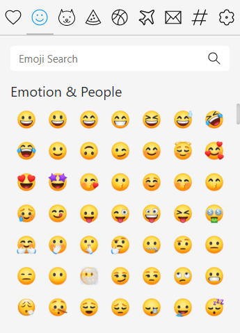
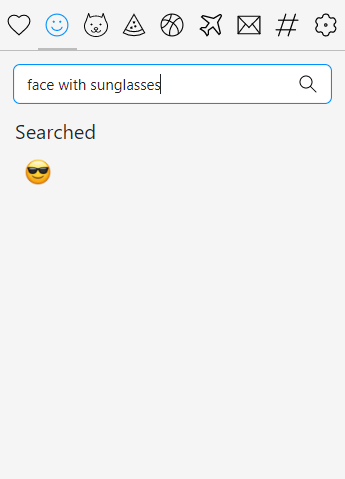
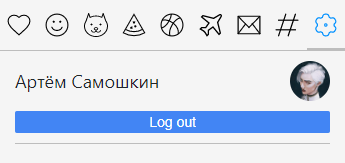

# Виджет эмодзи

https://chrome.google.com/webstore/detail/emoji-widget/gmagpgpipaiaflghjofnpjnpekpcagen/related?hl=ru&authuser=0

## Информация

Расширение для Google Chrome с возможностью вставки эмодзи в поля ввода на любом сайте.

Разработчики

- Самошкин Артём
- Вейнгардт Анастасия

Ментор

- Вдовиченко Андрей

## Общий вид

## Функционал

- ### Вставка эмодзи в поля ввода на сайтах

- ### Возможность скопировать или добавить в избранное эмодзи

- ### Недавние и избранные эмодзи

- ### Поиск на английском и на русском

- ### Тёмная тема

- ### Авторизация через Google аккаунт с сохранением состояния виджета в firebase

- ### Выбор схемы эмодзи (apple, google, twitter, facebook)

## Ссылка на инструкцию по установке

- https://disk.yandex.ru/d/fDFUwcpjGoJRkA
